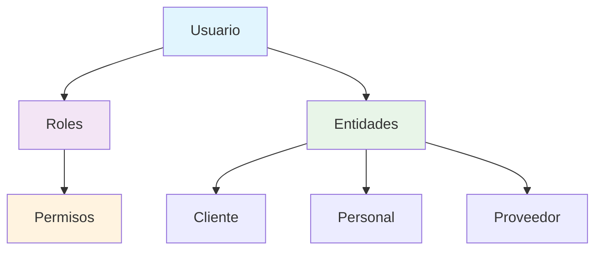

# 📘 Sistema de Usuarios, Roles y Entidades - Yola Fresh Utils

## 🎯 Descripción General

Este sistema implementa un **Role-Based Access Control (RBAC)** robusto y escalable para aplicaciones de retail, separando claramente los conceptos de **Usuario**, **Entidad** y **Rol**.

### Conceptos Clave

- **👤 Usuario**: Cuenta digital con credenciales y permisos
- **🏢 Entidad**: Contexto real (Cliente, Personal, Proveedor)  
- **🔐 Rol**: Define permisos y capacidades en el sistema

## 🏗️ Arquitectura



## 📦 Interfaces Principales

### Usuario
```typescript
interface Usuario {
  id: string;
  email: string;
  username: string;
  passwordHash: string;
  roles: Rol[];
  entidades: Entidad[];
  activo: boolean;
  // ... más campos
}
```

### Entidades
```typescript
// Base
interface Entidad {
  id: string;
  tipo: "Cliente" | "Personal" | "Proveedor";
  fechaCreacion: Date;
  activo: boolean;
}

// Específicas
interface Cliente extends Entidad {
  tipo: "Cliente";
  nombres: string;
  apellidos?: string;
  // ... campos específicos
}
```

### Roles y Permisos
```typescript
interface Rol {
  id: string;
  nombre: string;
  permisos: string[];
  activo: boolean;
}

enum Permisos {
  VENTAS_CREAR = "ventas:crear",
  PRODUCTOS_VER = "productos:ver",
  // ... más permisos
}
```

## 🚀 Uso Básico

### 1. Crear un Usuario Cliente

```typescript
import { crearUsuarioCliente } from "./examples/sistema-usuarios-ejemplo";

const cliente = crearUsuarioCliente();
console.log(cliente.username); // "juan.perez"
```

### 2. Validar Permisos

```typescript
import { puede, Permisos } from "./utils/rbac";

if (puede(usuario, Permisos.VENTAS_CREAR)) {
  // Usuario puede crear ventas
  crearVenta(datosVenta);
}
```

### 3. Middleware de Permisos

```typescript
import { requierePermiso } from "./utils/rbac";

function operacionProtegida(usuario: Usuario) {
  requierePermiso(Permisos.VENTAS_CREAR)(usuario);
  // Operación autorizada
}
```

## 🔐 Roles Predefinidos

| Rol | Descripción | Permisos Principales |
|-----|-------------|---------------------|
| **ADMIN** | Administrador completo | Todos los permisos |
| **CAJERO** | Operador de caja | Ventas, productos (ver), clientes |
| **VENDEDOR** | Vendedor | Ventas, clientes, productos (ver) |
| **CLIENTE** | Cliente del sistema | Productos (ver), perfil |
| **PROVEEDOR** | Proveedor de productos | Productos, perfil |
| **SUPERVISOR** | Supervisor de área | Ventas, reportes, personal |
| **CONTADOR** | Contador/Finanzas | Finanzas, reportes, ventas (ver) |

## 📋 Permisos Disponibles

### Ventas
- `ventas:crear` - Crear ventas
- `ventas:ver` - Ver ventas
- `ventas:editar` - Editar ventas
- `ventas:eliminar` - Eliminar ventas
- `ventas:reportes` - Generar reportes de ventas

### Productos
- `productos:crear` - Crear productos
- `productos:ver` - Ver productos
- `productos:editar` - Editar productos
- `productos:stock` - Gestionar stock

### Sistema
- `sistema:admin` - Administración completa
- `sistema:usuarios` - Gestión de usuarios
- `sistema:roles` - Gestión de roles

## 🛠️ Funciones Utilitarias

### Validación de Permisos
```typescript
// Permiso único
puede(usuario, "ventas:crear")

// Múltiples permisos (todos requeridos)
puedeMultiple(usuario, ["ventas:crear", "productos:ver"], true)

// Múltiples permisos (al menos uno)
puedeMultiple(usuario, ["ventas:ver", "ventas:crear"], false)

// Verificar rol
tieneRol(usuario, "cajero")
```

### Gestión de Sesiones
```typescript
// Crear contexto de sesión
const sesion = crearSesionContexto(usuario, entidadId);

// Verificar acceso a entidad
puedeAccederEntidad(usuario, "entidad_001")
```

### Obtener Información
```typescript
// Todos los permisos del usuario
const permisos = obtenerPermisos(usuario);

// Entidades accesibles por tipo
const clientes = obtenerEntidadesAccesibles(usuario, "Cliente");
```

## 🎯 Casos de Uso Comunes

### 1. Usuario Cliente Comprando
```typescript
const cliente = crearUsuarioCliente();

// ✅ Puede ver productos
if (puede(cliente, Permisos.PRODUCTOS_VER)) {
  mostrarCatalogo();
}

// ❌ NO puede crear ventas directamente
if (!puede(cliente, Permisos.VENTAS_CREAR)) {
  // Redirigir a proceso de compra
}
```

### 2. Cajero Procesando Venta
```typescript
const cajero = crearUsuarioCajero();

// ✅ Puede crear ventas
if (puede(cajero, Permisos.VENTAS_CREAR)) {
  const venta = procesarVenta(datosVenta);
}

// ✅ Puede crear clientes nuevos
if (puede(cajero, Permisos.CLIENTES_CREAR)) {
  const nuevoCliente = crearCliente(datos);
}
```

### 3. Usuario con Múltiples Roles
```typescript
// Usuario que es cliente Y empleado
const usuario = {
  roles: [rolCliente, rolCajero],
  entidades: [entidadCliente, entidadPersonal]
};

// Puede actuar en ambos contextos
const sesionComoCliente = crearSesionContexto(usuario, entidadCliente.id);
const sesionComoEmpleado = crearSesionContexto(usuario, entidadPersonal.id);
```

## 🔄 Integración con Sistemas Existentes

### ShoppingCart y Venta
El sistema se integra perfectamente con las clases existentes:

```typescript
// En ShoppingCart - obtener nombre del usuario
function obtenerNombreUsuario(usuario: Usuario | null): string {
  if (!usuario?.entidades?.length) return "Usuario";
  
  for (const entidad of usuario.entidades) {
    if (entidad.tipo === "Cliente") {
      const cliente = entidad as Cliente;
      return `${cliente.nombres} ${cliente.apellidos || ''}`.trim();
    }
  }
  
  return usuario.username || "Usuario";
}
```

### Finanzas y Pagos
Los roles determinan qué operaciones financieras puede realizar cada usuario:

```typescript
// Solo contadores y administradores
if (puede(usuario, Permisos.FINANZAS_CREAR)) {
  crearMovimientoFinanciero(datos);
}
```

## ⚡ Rendimiento y Escalabilidad

### Optimizaciones
- **Caché de permisos**: Los permisos se calculan una vez por sesión
- **Lazy loading**: Las entidades se cargan bajo demanda
- **Índices de base de datos**: Optimización para consultas frecuentes

### Escalabilidad
- **Nuevas entidades**: Fácil agregar (Transportista, Socio, etc.)
- **Nuevos permisos**: Sistema de permisos granular y extensible
- **Múltiples roles**: Un usuario puede tener N roles simultáneamente

## 🧪 Testing

### Ejecutar Ejemplos
```bash
# Ejecutar ejemplos completos
npm run test:usuarios

# O directamente con Node
node dist/examples/sistema-usuarios-ejemplo.js
```

### Tests Unitarios
```typescript
import { puede, crearRolPredefinido } from "./utils/rbac";

describe("Sistema RBAC", () => {
  test("Cajero puede crear ventas", () => {
    const cajero = crearUsuarioCajero();
    expect(puede(cajero, Permisos.VENTAS_CREAR)).toBe(true);
  });
  
  test("Cliente NO puede eliminar productos", () => {
    const cliente = crearUsuarioCliente();
    expect(puede(cliente, Permisos.PRODUCTOS_ELIMINAR)).toBe(false);
  });
});
```

## 🔒 Seguridad

### Buenas Prácticas Implementadas
- **Principio de menor privilegio**: Cada rol tiene solo los permisos necesarios
- **Validación en cada operación**: Nunca confiar solo en el frontend
- **Sesiones seguras**: Tokens con expiración y refresh
- **Auditoría**: Registro de todas las operaciones sensibles

### Recomendaciones
- Usar HTTPS en producción
- Implementar rate limiting
- Logs de seguridad detallados
- Revisión periódica de permisos

## 📚 Recursos Adicionales

- **Ejemplos completos**: `src/examples/sistema-usuarios-ejemplo.ts`
- **Tests**: `tests/rbac.test.ts`
- **Documentación API**: Comentarios JSDoc en el código
- **Diagramas**: Mermaid diagrams en este README

---

## 🤝 Contribución

Para agregar nuevos roles, permisos o entidades:

1. Actualizar las interfaces en `src/interfaces/`
2. Agregar permisos en `src/interfaces/entidades.ts`
3. Configurar roles en `src/utils/rbac.ts`
4. Crear ejemplos en `src/examples/`
5. Actualizar esta documentación

---

**Versión**: 1.0.0  
**Última actualización**: Septiembre 2024  
**Mantenedor**: Equipo Yola Fresh
