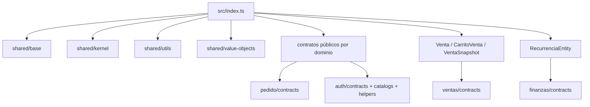

# Arquitectura Vigente del Core

## Visión general

El core vigente de `yolafresh-utils` queda orientado a contratos de negocio, primitivas de dominio y pocas entidades ricas de alto valor transversal.

La versión publicada de referencia es `2.0.0` (`v2.0.0`).

La evidencia principal está en [src/index.ts](../../index.ts).

## Surface pública raíz

La raíz exporta hoy:

- `shared/base`
- `shared/kernel`
- `shared/utils`
- `shared/value-objects`
- contratos públicos de `pedido`, `ventas`, `compras`, `inventario`, `tesoreria`, `finanzas`, `auth`, `personas` y `contabilidad`;
- `Venta`
- `CarritoVenta`
- `VentaSnapshot`
- `RecurrenciaEntity`

## Capas observadas

### `shared/base`

Vive en [base/index.ts](../../domain/shared/base/index.ts) y publica:

- `Entity`
- `AggregateRoot`
- `ValueObject`
- `DomainEvent`

Su responsabilidad es lenguaje estructural mínimo.

### `shared/kernel`

Vive en [kernel/index.ts](../../domain/shared/kernel/index.ts) y concentra contratos realmente transversales:

- documentos;
- empresa;
- evidencias;
- enums;
- configuración fiscal.

### `shared/utils`

Vive en [utils/index.ts](../../domain/shared/utils/index.ts) y quedó reducido a soporte temporal puro:

- `DateUtils`
- `generarUlid`
- `UnixMillis`
- `ISODateString`
- `ISODateOnly`

### `shared/value-objects`

Vive en [value-objects/index.ts](../../domain/shared/value-objects/index.ts) y publica:

- `EmpresaId`
- `SucursalId`

## Ownership por dominio

Los contratos ya no viven en `shared/interfaces`.

Ahora se distribuyen en:

- `pedido/contracts`
- `ventas/contracts`
- `compras/contracts`
- `inventario/contracts`
- `tesoreria/contracts`
- `finanzas/contracts`
- `auth`
- `personas/contracts`
- `contabilidad/contracts`

## Entidades ricas vigentes

El paquete todavía conserva comportamiento de dominio en:

- [Venta](../../domain/ventas/entities/Venta.ts)
- [CarritoVenta](../../domain/ventas/entities/CarritoVenta.ts)
- [VentaSnapshot](../../domain/ventas/entities/VentaSnapshot.ts)
- [Compra](../../domain/compras/entities/Compra.ts)
- [RecurrenciaEntity](../../domain/finanzas/entities/RecurrenciaEntity.ts)
- [catálogo auth](../../domain/auth/index.ts)
- [Usuario](../../domain/personas/entities/Usuario.ts)
- [AsientoContable](../../domain/contabilidad/entities/AsientoContable.ts)

`Pedido` y `PedidoEntrega` son contratos publicados del dominio `pedido`; no son
entidades ricas con comportamiento dentro de esta librería.

## Qué salió del core

La estructura vigente excluye:

- utilidades de UI y DOM;
- multimedia e íconos;
- mappers de persistencia;
- adapters a CouchDB, SQLite o APIs;
- processors y services operativos;
- publicación legacy basada en `domain/*` fuera de `dist`.

## Fronteras de responsabilidad

### Lo que sí resuelve

- lenguaje compartido del negocio;
- contratos canónicos por dominio;
- estados y clasificaciones;
- invariantes locales de agregados;
- eventos de dominio;
- primitivas base.

### Lo que no resuelve

- infraestructura;
- persistencia concreta;
- sincronización;
- render o UI;
- procesos operativos entre contextos;
- integraciones externas.

## Mapa del core

## Restricciones observadas

- `shared/` no debe volver a absorber contratos de dominio específico;
- nuevos contratos deben nacer en dominio propietario;
- entidades y eventos deben seguir independientes de infraestructura;
- publicación oficial debe seguir root mínimo + subpaths por dominio.

## Referencias

- [README.md](./README.md)
- [contratos-compartidos.md](./contratos-compartidos.md)
- [primitivas-y-publicacion.md](./primitivas-y-publicacion.md)
