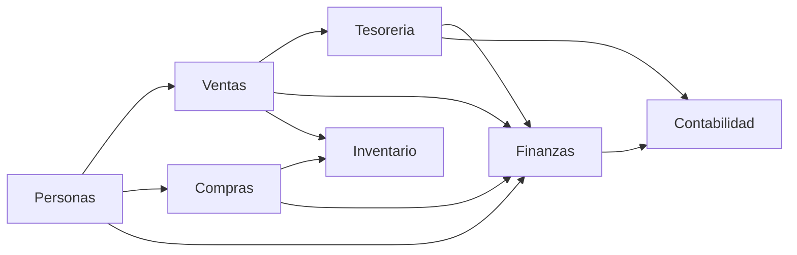
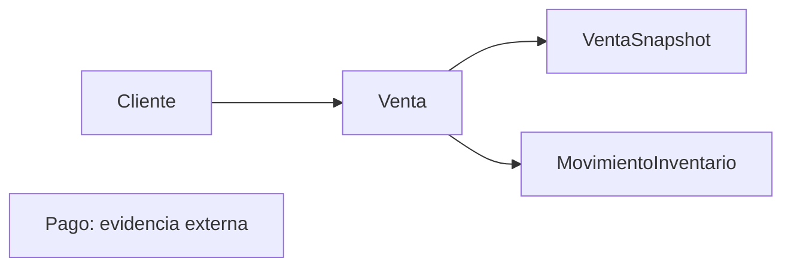
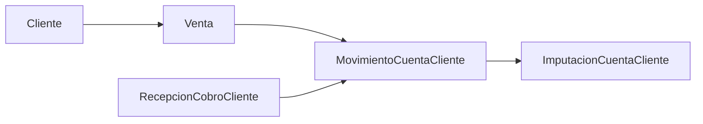
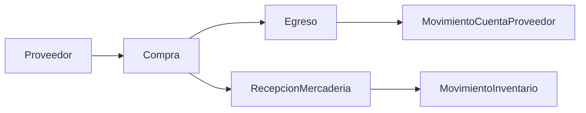

# Mapa del Dominio

## Propósito

Este documento ofrece vista de alto nivel del dominio modelado por `yolafresh-utils` para que una persona nueva entienda cómo se relacionan los módulos principales.

La evidencia principal vive en:

- [../ventas/relaciones-interdominio.md](../ventas/relaciones-interdominio.md)
- [../ventas/modelo-vigente.md](../ventas/modelo-vigente.md)
- [../finanzas/modelo-vigente.md](../finanzas/modelo-vigente.md)
- [../finanzas/cuenta-cliente-modelo-vigente.md](../finanzas/cuenta-cliente-modelo-vigente.md)
- [../tesoreria/modelo-vigente.md](../tesoreria/modelo-vigente.md)
- [../inventario/modelo-vigente.md](../inventario/modelo-vigente.md)
- [../compras/modelo-vigente.md](../compras/modelo-vigente.md)
- [../personas/modelo-vigente.md](../personas/modelo-vigente.md)
- [../contabilidad/modelo-vigente.md](../contabilidad/modelo-vigente.md)

## Vista general

El paquete modela dominio comercial y operativo mediante módulos que representan verdades distintas del negocio.

## Mapa principal

## Qué representa cada dominio

### `personas`

Representa actores reales del negocio y su identidad digital:

- clientes;
- personal;
- proveedores;
- usuarios;
- roles y permisos.

### `ventas`

Representa operación comercial de venta:

- captura previa con `CarritoVenta`;
- hecho comercial con `Venta`;
- representación histórica con `VentaSnapshot`;
- reserva comercial con `Pedido`.

### `tesoreria`

Representa operación diaria del dinero:

- cajas;
- turnos;
- movimientos de caja;
- pagos capturados.

### `finanzas`

Representa relación monetaria ampliada:

- ingresos y egresos;
- cuentas con proveedor;
- cuenta cliente;
- recurrencias;
- contratos auxiliares de consolidación.

### `inventario`

Representa verdad física del stock:

- almacenes;
- stock por presentación;
- movimientos;
- transferencias;
- recepciones.

### `compras`

Representa abastecimiento económico:

- compra formal a proveedor;
- items comprados;
- condición y estado de pago;
- referencias a egresos.

### `contabilidad`

Representa registro balanceado:

- periodos;
- cuentas;
- asientos;
- líneas contables.

## Flujos de negocio frecuentes

### Venta de contado

Lectura correcta:

- `Venta` responde hecho comercial;
- `Pago` responde evidencia externa externa al flujo comercial y operativo;
- `MovimientoCaja` responde impacto operativo en caja;
- `MovimientoInventario` responde salida de stock.

### Venta a crédito

Lectura correcta:

- deuda y cobro no viven dentro de `Venta`;
- relación financiera del cliente vive en `finanzas`.

### Compra a proveedor

Lectura correcta:

- `Compra` es documento económico;
- `RecepcionMercaderia` es ingreso físico;
- `Egreso` es salida monetaria;
- `MovimientoCuentaProveedor` expresa relación financiera con proveedor.

## Separaciones más importantes

### Comercial vs cobro

- `Venta` no es `Pago`.
- `Venta` no es `MovimientoCaja`.

### Comercial vs deuda o saldo

- `Venta` no es `CuentaCliente`.
- `ResumenCuentaCliente` no reemplaza ledger oficial.

### Económico vs físico

- `Compra` no es `RecepcionMercaderia`.
- `Compra` no es `MovimientoInventario`.

### Operativo vs contable

- `MovimientoCaja` no es `AsientoContable`.
- `Ingreso` o `Egreso` no son por sí solos contabilidad formal.

## Cómo leer el mapa si eres nuevo

- si tu pregunta es “qué se vendió”, empieza en `ventas`;
- si tu pregunta es “qué dinero entró o salió hoy”, empieza en `tesoreria`;
- si tu pregunta es “qué saldo o deuda quedó”, empieza en `finanzas`;
- si tu pregunta es “qué stock cambió”, empieza en `inventario`;
- si tu pregunta es “qué se compró a proveedor”, empieza en `compras`;
- si tu pregunta es “quién es actor del sistema”, empieza en `personas`;
- si tu pregunta es “cómo se balancea contablemente”, empieza en `contabilidad`.

## Límites vigentes del paquete

- el mapa separa dominios y ownership semántico, pero no impone secuencia operativa única entre ellos;
- la librería no obliga momento único para generar `MovimientoInventario` desde `Venta`;
- la consolidación hacia contabilidad formal queda como responsabilidad de consumers a partir de contratos existentes.

## Referencias

- [vision-general-del-paquete.md](./vision-general-del-paquete.md)
- [guia-de-onboarding.md](./guia-de-onboarding.md)
- [../ventas/relaciones-interdominio.md](../ventas/relaciones-interdominio.md)
