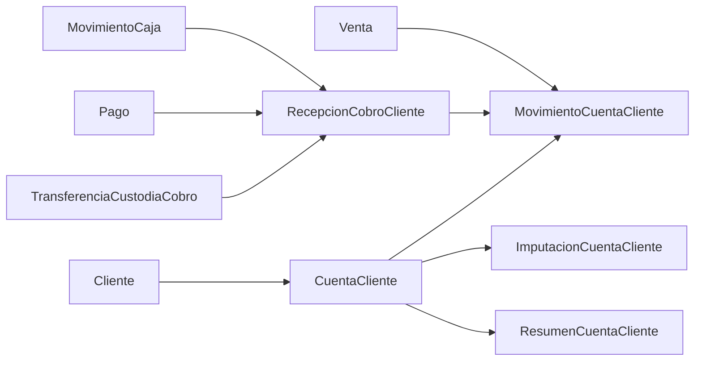

# Cuenta Cliente

## Propósito

Este directorio agrupa la documentación vigente del Domain de cuenta cliente en `yolafresh-utils`.

La fuente principal de evidencia es [customer-account.ts](../../domain/shared/interfaces/customer-account.ts).

## Alcance

Este Domain documenta:

- identidad y estado de la cuenta del cliente
- deuda y saldo a favor
- cobros y adelantos
- imputación entre movimientos
- recepción y custodia del dinero
- resumen reconstruible para lectura rápida

Este Domain no reemplaza:

- `Venta` como hecho comercial
- `Pago` como captura o conciliación del medio de pago
- `MovimientoCaja` como ledger operativo de tesorería

## Documentos

- [modelo-vigente.md](./modelo-vigente.md): conceptos principales, estados, relaciones y reglas de negocio observadas.
- [flujos-cobros-y-adelantos.md](./flujos-cobros-y-adelantos.md): casos operativos mínimos para adelantos, cobros, uso de saldo y reversas.
- [trazabilidad-y-auditoria.md](./trazabilidad-y-auditoria.md): separación entre recepción, custodia, ledger e información de lectura.
- [guia-de-consumo.md](./guia-de-consumo.md): guía para consumidores externos del modelo vigente.

## Terminología canónica

Los nombres vigentes del contrato son:

- `CuentaCliente`
- `MovimientoCuentaCliente`
- `ImputacionCuentaCliente`
- `RecepcionCobroCliente`
- `TransferenciaCustodiaCobro`
- `ResumenCuentaCliente`

## Relaciones principales

## Preguntas abiertas

- Cuál es política funcional exacta para pasar de `RECIBIDO` a `LIQUIDADO` en `RecepcionCobroCliente`.
- Cuándo un `MovimientoCuentaCliente` debe quedar en `CONFIRMADO` versus `CONTABILIZADO`.
- Cuál es política uniforme de uso entre `REVERSA`, `ANULADO`, `RECHAZADO` y `REVERTIDO`.

## Referencias

- [customer-account.ts](../../domain/shared/interfaces/customer-account.ts)
- [../README.md](../README.md)
