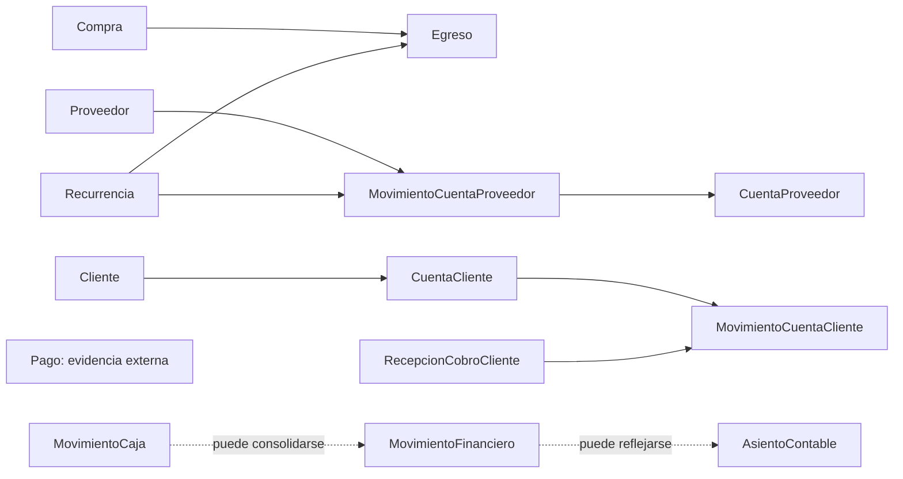

# Finanzas

## Propósito

Este directorio agrupa la documentación vigente del Domain de finanzas en `yolafresh-utils`.

La evidencia principal vive en:

- [finanzas.contract.ts](../../domain/finanzas/contracts/finanzas.contract.ts)
- [ledger-auxiliar.contract.ts](../../domain/finanzas/contracts/ledger-auxiliar.contract.ts)
- [recurrencia.contract.ts](../../domain/finanzas/contracts/recurrencia.contract.ts)
- [cuenta-cliente.contract.ts](../../domain/finanzas/contracts/cuenta-cliente.contract.ts)
- [RecurrenciaEntity.ts](../../domain/finanzas/entities/RecurrenciaEntity.ts)

## Alcance

Este Domain documenta:

- ingresos, egresos, cambios y anulaciones;
- relación financiera con proveedor;
- cuentas bancarias y clasificaciones de pago;
- cuenta cliente, cobros, custodia e imputaciones;
- recurrencias de negocio;
- contratos auxiliares de consolidación financiera.

Este Domain no reemplaza:

- `MovimientoCaja` como trazabilidad operativa de tesorería;
- `AsientoContable` como registro contable balanceado.

## Por qué existe este Domain

`finanzas` existe para modelar relación monetaria del negocio más allá de la operación inmediata de caja.

Su valor está en separar:

- salida y entrada financiera;
- relación con proveedor;
- deuda y saldo del cliente;
- recurrencias;
- vistas auxiliares de consolidación.

Esa separación evita que tesorería, ventas o contabilidad absorban responsabilidades financieras que no les pertenecen.

## Cuándo entra en juego

Este Domain entra en juego cuando un consumer necesita:

- registrar ingreso, egreso, cambio o anulación;
- modelar cuenta proveedor;
- modelar cuenta cliente, cobros, custodia e imputaciones;
- expresar recurrencias del negocio;
- consolidar lectura financiera auxiliar previa a contabilidad formal.

## Qué problema evita

Evita errores conceptuales como:

- usar `MovimientoCaja` como única verdad financiera;
- usar `Venta` para modelar deuda o saldo del cliente;
- usar `ResumenCuentaCliente` como ledger oficial;
- usar contabilidad formal para resolver operación financiera diaria.

## Documentos

- [modelo-vigente.md](./modelo-vigente.md): conceptos, responsabilidades, relaciones y restricciones vigentes.
- [cuenta-cliente-modelo-vigente.md](./cuenta-cliente-modelo-vigente.md): relación financiera con cliente, saldo, cobros e imputaciones.
- [cuenta-cliente-operacion-y-auditoria.md](./cuenta-cliente-operacion-y-auditoria.md): flujos mínimos, custodia y trazabilidad.
- [recurrencias-backend.md](./recurrencias-backend.md): guía histórica de consumo backend para recurrencias.
- [recurrencias-frontend.md](./recurrencias-frontend.md): guía histórica de consumo frontend y offline-first.
- [recurrentes.md](./recurrentes.md): contexto histórico de casos de uso potenciales.

## Terminología canónica

- `Egreso`
- `Ingreso`
- `Cambio`
- `Anulacion`
- `MovimientoCuentaProveedor`
- `CuentaProveedor`
- `CuentaBancaria`
- `CuentaCliente`
- `MovimientoCuentaCliente`
- `ImputacionCuentaCliente`
- `RecepcionCobroCliente`
- `TransferenciaCustodiaCobro`
- `ResumenCuentaCliente`
- `Recurrencia`
- `RecurrenciaEntity`
- `MovimientoFinanciero`

## Relaciones principales

Lectura correcta del diagrama:

- las flechas sólidas representan relación estructural fuerte;
- las flechas punteadas representan relación eventual o dependiente de decisión operativa;
- `Pago` no forma parte de cadena financiera canónica ni genera movimientos por sí mismo.

## Decisiones vigentes observables

- `MovimientoFinanciero` en `ledger-auxiliar.contract.ts` se documenta como contrato auxiliar histórico y no como fuente canónica de auditoría;
- `Recurrencia` hoy publica payload tipado solo para `CREAR_EGRESO` y `CREAR_CARGO_CLIENTE`; el resto de acciones permanece genérico;
- `CuentaProveedor` sigue siendo saldo resumido por proveedor; el detalle auditable vive en `MovimientoCuentaProveedor`.

## Referencias

- [../README.md](../README.md)
- [../tesoreria/README.md](../tesoreria/README.md)
- [../compras/README.md](../compras/README.md)
- [../contabilidad/README.md](../contabilidad/README.md)
