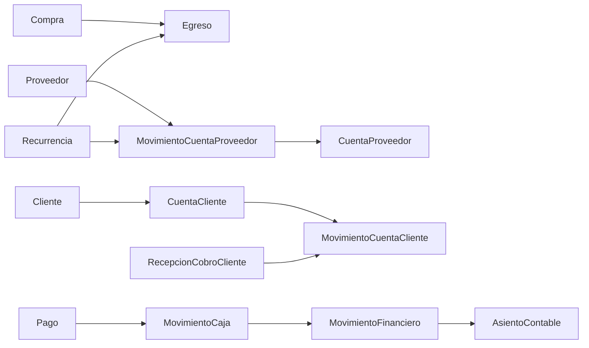

# Finanzas

## Propósito

Este directorio agrupa la documentación vigente del Domain de finanzas en `yolafresh-utils`.

La evidencia principal vive en:

- [finanzas.contract.ts](../../domain/finanzas/contracts/finanzas.contract.ts)
- [ledger-auxiliar.contract.ts](../../domain/finanzas/contracts/ledger-auxiliar.contract.ts)
- [recurrencia.contract.ts](../../domain/finanzas/contracts/recurrencia.contract.ts)
- [cuenta-cliente.contract.ts](../../domain/finanzas/contracts/cuenta-cliente.contract.ts)
- [RecurrenciaEntity.ts](../../domain/finanzas/entities/RecurrenciaEntity.ts)

## Alcance

Este Domain documenta:

- ingresos, egresos, cambios y anulaciones;
- relación financiera con proveedor;
- cuentas bancarias y clasificaciones de pago;
- cuenta cliente, cobros, custodia e imputaciones;
- recurrencias de negocio;
- contratos auxiliares de consolidación financiera.

Este Domain no reemplaza:

- `MovimientoCaja` como trazabilidad operativa de tesorería;
- `AsientoContable` como registro contable balanceado.

## Documentos

- [modelo-vigente.md](./modelo-vigente.md): conceptos, responsabilidades, relaciones y restricciones vigentes.
- [cuenta-cliente-modelo-vigente.md](./cuenta-cliente-modelo-vigente.md): relación financiera con cliente, saldo, cobros e imputaciones.
- [cuenta-cliente-operacion-y-auditoria.md](./cuenta-cliente-operacion-y-auditoria.md): flujos mínimos, custodia y trazabilidad.
- [recurrencias-backend.md](./recurrencias-backend.md): guía histórica de consumo backend para recurrencias.
- [recurrencias-frontend.md](./recurrencias-frontend.md): guía histórica de consumo frontend y offline-first.
- [recurrentes.md](./recurrentes.md): contexto histórico de casos de uso potenciales.

## Terminología canónica

- `Egreso`
- `Ingreso`
- `Cambio`
- `Anulacion`
- `MovimientoCuentaProveedor`
- `CuentaProveedor`
- `CuentaBancaria`
- `CuentaCliente`
- `MovimientoCuentaCliente`
- `ImputacionCuentaCliente`
- `RecepcionCobroCliente`
- `TransferenciaCustodiaCobro`
- `ResumenCuentaCliente`
- `Recurrencia`
- `RecurrenciaEntity`
- `MovimientoFinanciero`

## Relaciones principales

## Preguntas abiertas

- si `MovimientoFinanciero` en `ledger.ts` seguirá como contrato auxiliar histórico o se dividirá en contratos más específicos;
- qué acciones de `Recurrencia` pasarán de `unknown` a payload tipado estable;
- hasta dónde `CuentaProveedor` debe seguir como saldo resumido y no como ledger detallado.

## Referencias

- [../README.md](../README.md)
- [../tesoreria/README.md](../tesoreria/README.md)
- [../compras/README.md](../compras/README.md)
- [../contabilidad/README.md](../contabilidad/README.md)
