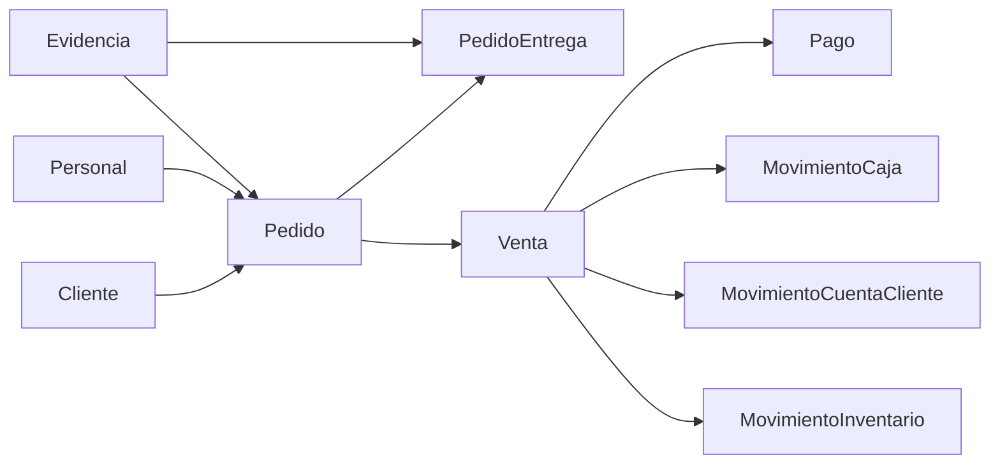

# Relaciones Interdominio de Pedido

## Propósito

Este documento explica cómo se relaciona `Pedido` con otros Domains activos del paquete sin mezclar ownership semántico.

## Regla general

`Pedido` responde pregunta comercial y operativa previa:

> qué reservó cliente, para cuándo, con qué prioridad, desde qué procedencia y con qué avance de atención

`PedidoEntrega` responde pregunta logística:

> qué pasa con el seguimiento físico u operativo de ese pedido

## Relación con `Ventas`

### Qué aporta cada Domain

- `Pedido`: reserva comercial;
- `PedidoEntrega`: seguimiento logístico del pedido;
- `Venta`: hecho comercial confirmado.

### Regla canónica

`Pedido` y `Venta` no son el mismo documento.

Relación observada:

- `Pedido.ventaId` puede referenciar la venta originada;
- `Venta.pedidoId` mantiene trazabilidad inversa;
- `PedidoState.CONVERTIDO` expresa que la reserva ya generó `Venta`.

## Relación con `Personas`

Campos observados:

- `clienteId`
- `responsableId`
- `creadoPorId`

Lectura correcta:

- `clienteId` identifica a quién pertenece la reserva;
- `responsableId` identifica quién opera o atiende el pedido;
- `creadoPorId` identifica quién registró el pedido.

## Relación con `Tesoreria`

`Pedido` no cobra dinero.

Regla canónica:

- `Pago` representa evidencia externa o validable de cobro;
- `MovimientoCaja` representa impacto real en caja;
- esos conceptos no deben convertirse en estados de `Pedido`.

## Relación con `Finanzas`

`Pedido` no modela deuda, saldo ni imputación.

Si operación termina en crédito o consumo de saldo:

- `Venta` y `MovimientoCuentaCliente` resuelven ese ownership.

## Relación con `Inventario`

`Pedido` no reemplaza a `MovimientoInventario`.

Lectura correcta:

- un pedido puede motivar preparación o reserva operativa;
- el impacto canónico de stock sigue correspondiendo a `inventario`.

## Relación con `Evidencia`

`Pedido` y `PedidoEntrega` se relacionan con `Evidencia` por referencia externa:

- `PEDIDO`
- `PEDIDO_ENTREGA`

Esto evita embebidos innecesarios dentro del contrato primario.

## Mapa general

## Referencias

- [modelo-vigente.md](./modelo-vigente.md)
- [guia-de-consumo.md](./guia-de-consumo.md)
- [../ventas/relaciones-interdominio.md](../ventas/relaciones-interdominio.md)
