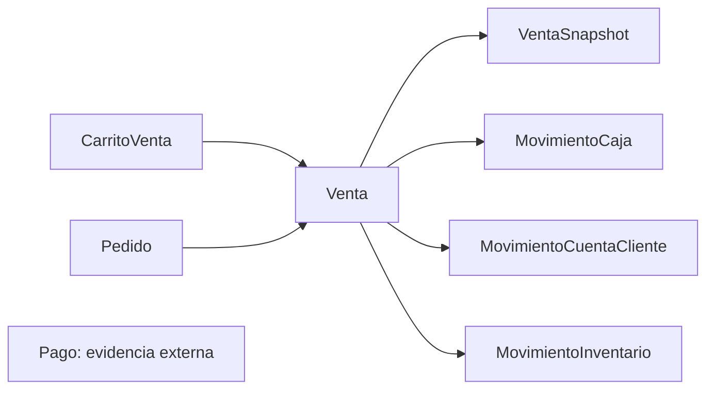

# Modelo Vigente de Ventas

## Visión general

El Domain de ventas modela tres capas distintas:

- `CarritoVenta`: captura mutable en curso
- `Venta`: hecho comercial confirmado
- `VentaSnapshot`: representación histórica visible y durable

El objetivo del modelo vigente es evitar que `Venta` mezcle cobro, caja, deuda y snapshot UI como parte primaria de su contrato.

## Conceptos principales

### `CarritoVenta`

`CarritoVenta` representa el estado mutable de captura operativa.

Responsabilidades observadas:

- agregar y quitar productos
- calcular subtotal, impuesto y total
- mantener trazabilidad operativa de cliente y personal
- conservar configuración fiscal durante captura
- conservar `procedencia` del flujo comercial

No modela como propiedad pública primaria:

- `notas`
- `tasaImpuesto` paralela a `configuracionFiscal`
- `clienteId` derivado
- `personalId` derivado

### `Venta`

`Venta` representa el hecho comercial confirmado.

Responsabilidades observadas:

- identificar la venta
- expresar estado comercial
- expresar condición de pago de cierre
- congelar `items`, `totales`, `clienteId` y `vendedorId`
- relacionar un `pedidoId` opcional
- emitir `VentaConfirmada` al confirmar

No modela como propiedad primaria:

- cobro
- caja
- deuda
- fiscalización
- `esPedido`

### `VentaSnapshot`

`VentaSnapshot` representa la versión histórica mostrable de la venta.

Responsabilidades observadas:

- preservar nombres visibles de productos
- preservar actores visibles (`cliente`, `vendedor`)
- preservar `subtotal`, `impuesto`, `total`, `codigoVenta` y `procedencia`
- seguir siendo útil aunque cambie catálogo vivo

No reemplaza a `Venta`.

### `Pedido`

`Pedido` representa reserva comercial pendiente de atención o conversión.

Si una venta nace desde un pedido, la relación correcta es `pedidoId`.

## Estados y lifecycle

### `VentaState`

- `CONFIRMADA`
- `ANULADA`

Lectura de negocio observada:

- `CONFIRMADA`: venta cerrada comercialmente
- `ANULADA`: venta revertida por flujo explícito

### `CondicionPagoVenta`

- `CONTADO`
- `CREDITO`

Lectura de negocio observada:

- `CONTADO`: la venta nace con cancelación total en el mismo cierre comercial
- `CREDITO`: la venta nace como hecho comercial confirmado y además debe reflejar deuda en `CuentaCliente`

### `CarritoVenta`

`CarritoVenta` no expone estado canónico de negocio equivalente a `VentaState`. Su rol es captura mutable.

### `Pedido`

`Pedido` usa ciclo de vida propio y no debe mezclarse con `VentaState`.

## Contratos nucleares

### `Venta`

Campos canónicos observados:

- `id`
- `nombre`
- `type`
- `estado`
- `condicionPago`
- `items`
- `pedidoId`
- `subtotal`
- `impuesto`
- `total`
- `montoRedondeo`
- `procedencia`
- `clienteId`
- `vendedorId`
- `codigoVenta`
- `numeroVenta`
- `createdAt`
- `updatedAt`

### `VentaItem`

Campos observados:

- `id`
- `presentacionId`
- `cantidadVendida`
- `precioUnitario`
- `montoTotal`
- `montoModificado`
- `descuento`

### `VentaSnapshot`

Campos canónicos observados:

- `id`
- `type`
- `ventaId`
- `createdAt`
- `items`
- `subtotal`
- `descuentoTotal`
- `impuesto`
- `montoRedondeo`
- `total`
- `codigoVenta`
- `procedencia`
- `cliente`
- `vendedor`

### `VentaSnapshotItem`

Campos observados:

- `id`
- `presentacionId`
- `nombre`
- `cantidadVendida`
- `precioUnitario`
- `total`
- `imagenUrl`
- `unidadComercial`
- `montoModificado`
- `descuento`

## Reglas de negocio respaldadas por contrato

- `Venta` debe tener al menos un item
- `total` de `Venta` debe ser mayor a cero
- `subtotal` e `impuesto` no pueden ser negativos
- `condicionPago` es obligatoria y no debe modelarse como estado
- `Venta.confirmar()` no permite confirmar venta vacía
- `CarritoVenta` ya no captura `metodoPago` ni `dineroRecibido` como parte de su contrato vigente
- `CarritoVenta` ya no publica `notas`, `tasaImpuesto`, `clienteId` ni `personalId` como parte de su contrato compartido vigente
- `montoModificado` preserva un total manual de línea, pero no autoriza reinterpretar `precioUnitario`
- `montoTotal` de item representa monto bruto de línea antes de aplicar `descuento`
- si cambia `quantity` en un ítem con `montoModificado`, el override manual previo deja de aplicar y la línea vuelve a cálculo normal
- `CarritoVenta` redondea dinero a 2 decimales; cualquier ajuste por sencillo o cierre físico debe modelarse en `Venta.montoRedondeo`
- `VentaSnapshot` debe tener al menos un item
- `VentaSnapshot.total` debe ser consistente con `subtotal - descuentoTotal + impuesto + montoRedondeo`
- `VentaSnapshot` no admite montos negativos
- `VentaSnapshot.montoRedondeo` admite valor firmado: negativo, cero o positivo
- `VentaSnapshot` es proyección histórica de `Venta`; no debe bloquear persistencia operativa de la venta en POS

## Separación canónica

Lectura correcta:

- `CarritoVenta` prepara operación
- `Venta` congela hecho comercial
- `VentaSnapshot` congela representación humana
- `Pago` conserva evidencia externa de pago sin producir movimientos por sí mismo
- `MovimientoCaja` resuelve tesorería
- `MovimientoCuentaCliente` resuelve deuda o saldo
- `MovimientoInventario` resuelve impacto de stock

## Límites vigentes del paquete

- `Venta` publica estado `ANULADA`, pero la librería no orquesta cascadas automáticas sobre caja, cuenta cliente o inventario;
- `VentaSnapshot` existe como representación histórica disponible desde la propia entidad `Venta`, pero cada consumer decide momento exacto de persistencia;
- logística o despacho físico no viven como estado canónico dentro de `Venta`; si el consumer necesita esa dimensión, debe modelarla aparte.

## Referencias

- [README.md](./README.md)
- [relaciones-interdominio.md](./relaciones-interdominio.md)
- [guia-de-consumo.md](./guia-de-consumo.md)
