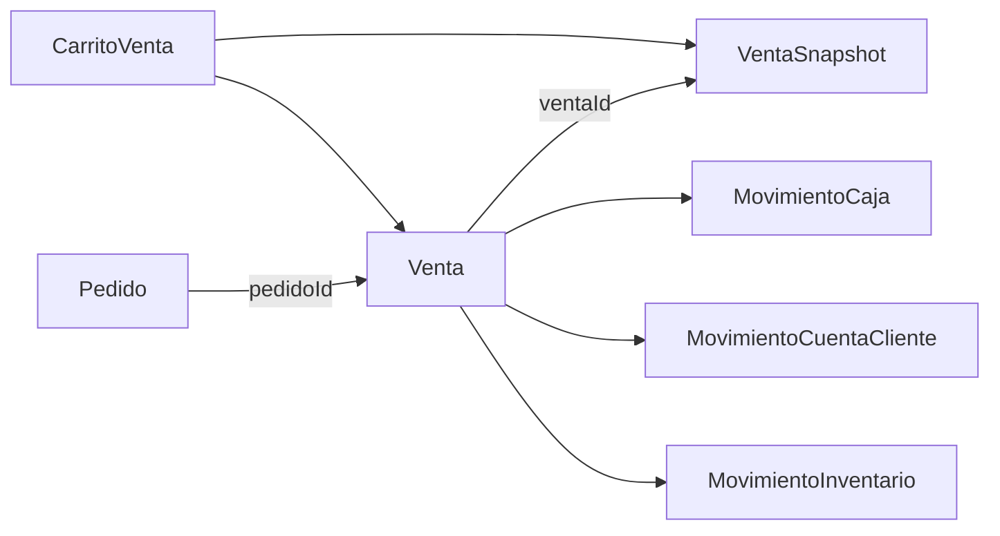

# Modelo vigente de Ventas

## Visión general

El Domain de ventas separa tres momentos:

- `CarritoVenta`: captura mutable en curso;
- `Venta`: raíz y resumen del hecho comercial confirmado;
- `VentaSnapshot`: detalle histórico inmutable asociado a la venta.

Desde esta revisión, `Venta` ya no duplica el array detallado de líneas. El campo `Venta.items` es un número entero que representa cuántas líneas contiene `VentaSnapshot.items`.

## Decisión de almacenamiento

Antes existían dos contratos de detalle:

- `VentaItem[]` dentro de `Venta`;
- `VentaSnapshotItem[]` dentro de `VentaSnapshot`.

Ambos repetían identificador, presentación, cantidades, precios y ajustes. El modelo vigente elimina `VentaItem` y conserva un único detalle canónico: `VentaSnapshotItem`.

Consecuencias:

- `IVenta.items` es `number`;
- `VentaItem` deja de exportarse;
- `VentaSnapshot.items` conserva el detalle transaccional e histórico;
- el conteo debe coincidir con `VentaSnapshot.items.length`;
- `Venta.toJSON()` nunca serializa el detalle transitorio;
- `Venta` y su snapshot deben guardarse como una misma unidad operativa local.

## Conceptos principales

### `CarritoVenta`

Representa captura mutable antes de confirmar:

- agrega y quita productos;
- calcula subtotal, impuesto, descuento y total;
- conserva producto, cliente, personal y configuración fiscal necesarios durante captura;
- permite un monto manual de línea mediante `montoModificado`.

El carrito sí mantiene líneas porque todavía está siendo editado.

### `Venta`

Representa la raíz del hecho comercial confirmado y publica un resumen compacto:

- identidad y estado comercial;
- condición de pago;
- cantidad de líneas mediante `items`;
- totales;
- cliente, vendedor y pedido relacionados por ID;
- procedencia, código y numeración.

No contiene:

- array de productos;
- cobro o evidencia de pago;
- caja o turno;
- deuda del cliente;
- movimiento de inventario.

### `VentaSnapshot`

Es el documento de detalle histórico propiedad de la venta. Conserva exactamente un array de `VentaSnapshotItem` con:

- identidad de línea y presentación;
- nombre histórico;
- cantidad y precio;
- total y descuento;
- imagen y unidad comercial;
- señal de monto modificado.

No es una segunda versión editable de la venta. Es el detalle inmutable necesario para historial, voucher y reconstrucción visible.

### `Pedido`

`Pedido` pertenece a su propio Domain. Ventas sólo mantiene `pedidoId` cuando una venta nace desde una reserva comercial.

## Contratos nucleares

### `IVenta`

Campos canónicos:

- `id`
- `nombre`
- `type`
- `estado`
- `condicionPago`
- `items: number`
- `pedidoId`
- `createdAt`
- `updatedAt`
- `costoEnvio`
- `subtotal`
- `impuesto`
- `total`
- `montoRedondeo`
- `procedencia`
- `clienteId`
- `vendedorId`
- `codigoVenta`
- `numeroVenta`

`items` cuenta líneas del snapshot, no unidades físicas vendidas.

### `VentaCreateInput`

Además del resumen de `IVenta`, admite `snapshotItems?: VentaSnapshotItem[]` como contexto transitorio de construcción.

Ese campo:

- permite crear Venta y snapshot desde el mismo carrito;
- debe tener la misma longitud que `items`;
- no aparece en `Venta.toJSON()`;
- no debe persistirse dentro del documento `venta`.

### `VentaSnapshotItem`

Campos canónicos:

- `id`
- `presentacionId`
- `nombre`
- `cantidadVendida`
- `precioUnitario`
- `total`
- `imagenUrl`
- `unidadComercial`
- `montoModificado`
- `descuento`

### `IVentaSnapshot`

Campos canónicos:

- `id`
- `type = "venta_snapshot"`
- `ventaId`
- `createdAt`
- `items: VentaSnapshotItem[]`
- `subtotal`
- `descuentoTotal`
- `impuesto`
- `montoRedondeo`
- `total`
- `codigoVenta`
- `procedencia`
- `cliente`
- `vendedor`

## Estados

### `VentaState`

- `CONFIRMADA`
- `ANULADA`

### `CondicionPagoVenta`

- `CONTADO`
- `CREDITO`

La condición de pago no es estado de cobranza.

## Invariantes

- `Venta.items` debe ser un entero mayor a cero;
- si se proporcionan `snapshotItems`, su longitud debe coincidir con `Venta.items`;
- `VentaSnapshot.fromVenta()` rechaza un detalle cuya longitud no coincide;
- una venta rehidratada desde `IVenta` necesita recibir `context.items` para reconstruir el snapshot;
- `Venta.total` debe ser mayor a cero;
- subtotal e impuesto no pueden ser negativos;
- `montoRedondeo` debe ser finito y puede ser firmado;
- `VentaSnapshot` debe contener al menos una línea;
- el total del snapshot debe ser consistente con subtotal, descuentos, impuesto y redondeo;
- `VentaSnapshotItem.nombre` es obligatorio;
- cantidad vendida debe ser mayor a cero;
- precios, totales y descuentos no pueden ser negativos.

## Construcción recomendada

```ts
const venta = Venta.fromCarritoVenta(carrito, ventaId);
const ventaDoc = venta.toJSON();       // items: number
const snapshotDoc = venta.toVentaSnapshot(); // items: VentaSnapshotItem[]
```

`fromCarritoVenta()` mantiene el detalle sólo de forma transitoria para poder crear el snapshot. Después de serializar, una venta rehidratada no contiene ese array:

```ts
const venta = new Venta(ventaDoc);
const snapshot = venta.toVentaSnapshot({ items: detalleHistorico });
```

## Persistencia y sincronización

El consumer debe tratar `ventaDoc` y `snapshotDoc` como un bundle indivisible:

1. construir ambos antes de escribir;
2. validar que `ventaDoc.items === snapshotDoc.items.length`;
3. guardarlos en una misma transacción local cuando la persistencia lo permita;
4. no marcar la operación como completa si falta uno de los dos;
5. sincronizar con IDs deterministas y reconciliar el bundle en bootstrap.

La librería define contratos e invariantes, pero no implementa una transacción de persistencia.

## Separación interdominio



- `Venta` es la raíz comercial;
- `VentaSnapshot` es su detalle histórico único;
- `MovimientoCaja` resuelve tesorería;
- `MovimientoCuentaCliente` resuelve deuda o saldo;
- `MovimientoInventario` resuelve stock.

## Ruptura contractual

Este cambio es incompatible con consumers que:

- recorren `venta.items`;
- importan `VentaItem`;
- calculan cantidades o totales desde `Venta`;
- construyen `VentaSnapshot` implícitamente desde una venta rehidratada.

La migración está documentada en [migracion-venta-items-conteo.md](./migracion-venta-items-conteo.md).

## Referencias

- [README.md](./README.md)
- [guia-de-consumo.md](./guia-de-consumo.md)
- [relaciones-interdominio.md](./relaciones-interdominio.md)
