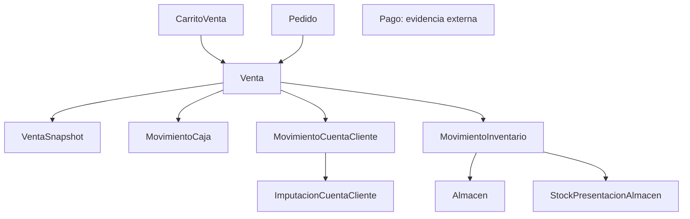

# Relaciones Interdominio de Ventas

## Propósito

Este documento explica cómo se relaciona `Venta` con otros Domains relevantes del ecosistema YolaFresh, especialmente subdominio de cuenta cliente dentro de `finanzas`, `Inventario`, `Almacén`, `Stock`, `Caja` y `Pago`.

## Regla general

`Venta` responde pregunta comercial:

> qué se vendió, a quién, por cuánto, en qué estado comercial y desde qué pedido opcional nació

Otros Domains responden preguntas distintas:

- `Pago`: qué evidencia externa de pago llegó y si fue validada
- `MovimientoCaja`: en qué caja o turno impactó dinero real
- `CuentaCliente`: qué deuda, saldo o aplicación quedó registrada
- `MovimientoInventario`: qué stock salió o se ajustó
- `Almacen`: desde dónde se movió stock

## Relación con `CuentaCliente`

### Qué aporta cada Domain

- `Venta`: hecho comercial
- `MovimientoCuentaCliente`: impacto financiero sobre la cuenta del cliente
- `ImputacionCuentaCliente`: aplicación entre créditos y débitos
- `ResumenCuentaCliente`: lectura resumida de saldo a favor o saldo por cobrar

### Casos típicos

#### Venta de contado sin deuda

- existe `Venta`
- `Venta.condicionPago = CONTADO`
- puede existir `Pago`
- puede existir `MovimientoCaja`
- no necesariamente existe `MovimientoCuentaCliente`

#### Venta a crédito

- existe `Venta`
- `Venta.condicionPago = CREDITO`
- existe impacto en `CuentaCliente`
- el cobro puede ocurrir después

#### Venta que consume saldo a favor

- existe `Venta`
- existe `MovimientoCuentaCliente`
- existe `ImputacionCuentaCliente` si se aplica crédito previo

### Regla canónica

No guardar deuda, saldo o adelanto dentro de `Venta`.

Esos conceptos viven en [finanzas](../finanzas/README.md) y en [cuenta-cliente/modelo-vigente.md](../finanzas/cuenta-cliente/modelo-vigente.md).

## Relación con `Pago`

`Pago` representa evidencia externa de pago validable por humano, no hecho comercial ni disparador de efectos.

Evidencia observada:

- `Pago.ventaId` se asigna solo cuando usuario relaciona evidencia con una venta
- `Pago` puede existir sin `ventaId`
- `Pago.movimientoCajaId` puede usarse como referencia posterior sin implicar causalidad
- `Pago.estado` expresa llegada y validación de evidencia externa

### Regla canónica

`Venta` no debe cargar evidencia de cobro ni estado de cobranza como propiedad primaria.

Tampoco debe asumirse que toda venta tendrá un `Pago` asociado ni que todo `Pago` terminará asociado a una venta o movimiento.

## Relación con `Caja`

`MovimientoCaja` expresa ingreso o egreso real en tesorería.

Campos relevantes observados:

- `turnoId`
- `cajaDestinoId`
- `tipo`
- `metodoPago`
- `referenciaTipo`
- `referenciaId`
- saldos posteriores

### Regla canónica

`turnoCajaId` y `caja` no viven en contrato principal de `Venta`.

La venta puede originar un movimiento de caja, pero no lo reemplaza.

## Relación con `Inventario`

`MovimientoInventario` expresa impacto real sobre stock.

Para una venta, la relación observada es:

- `tipo = SALIDA`
- `origenDocumento = VENTA`
- `documentoReferenciaId = ventaId`

### Regla canónica

La venta no modifica stock directamente. El stock cambia a través de `MovimientoInventario` y de la orquestación que implemente el consumer.

## Relación con `Almacen`

`Almacen` responde dónde está el stock.

Campos relevantes observados:

- `nombre`
- `tipo`
- `activo`
- `permitirLotes`
- `permitirNegativos`

Para una venta con salida de inventario, hace falta determinar `almacenOrigenId`. Esa decisión no vive dentro de `Venta`.

## Relación con `Stock`

`StockPresentacionAlmacen` expresa cantidad disponible por presentación y almacén.

Reglas observadas:

- stock no vive en la presentación
- el inventario está normalizado por almacén
- solo `MovimientoInventario` modifica stock

### Consecuencia para ventas

Una venta puede requerir validación previa de disponibilidad, pero esa validación no forma parte del agregado `Venta`.

## Relación con `Pedido`

`Pedido` y `Venta` no son mismo documento.

Relación vigente:

- `Pedido` representa reserva comercial
- `Venta` representa hecho comercial
- unión correcta: `pedidoId`

## Relación con `VentaSnapshot`

`VentaSnapshot` resuelve representación histórica visible:

- nombres de productos
- unidad comercial visible
- imagen
- cliente visible
- vendedor visible

`Venta` sigue resolviendo identidad, estado, condición de pago y montos canónicos.

## Mapa general

## Restricciones observadas

- `Venta` no define almacén origen
- `Venta` no define por sí sola impacto de caja
- `Venta` no define por sí sola impacto en cuenta cliente
- `Venta` no define por sí sola salida de stock

Eso se resuelve mediante integración entre Domains.

## Límites vigentes del paquete

- la relación entre `Venta` y `MovimientoInventario` es explícita pero no automática;
- el despacho físico o estado logístico no forman parte del estado canónico de `Venta`;
- el almacén origen y la política multi-almacén permanecen como decisión del consumer usando contratos de inventario.

## Referencias

- [modelo-vigente.md](./modelo-vigente.md)
- [guia-de-consumo.md](./guia-de-consumo.md)
- [../finanzas/cuenta-cliente/modelo-vigente.md](../finanzas/cuenta-cliente/modelo-vigente.md)
